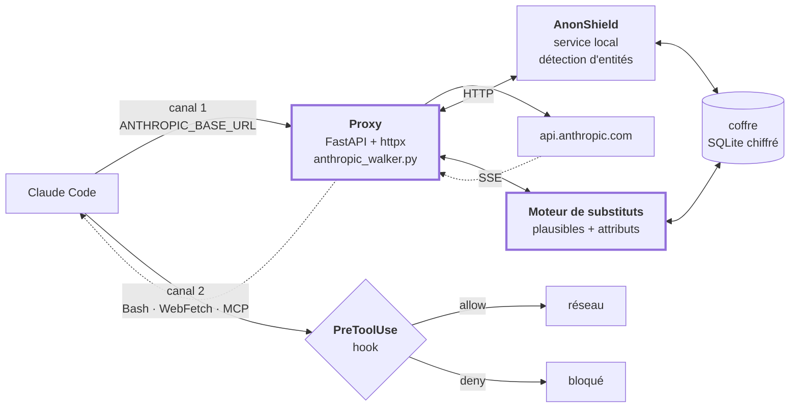

# Plan d'implémentation — Proxy de pseudonymisation pour agent DevOps (Claude Code)

> **Destinataire : agent d'implémentation.**
> Lis ce document en entier avant d'écrire du code. Les sections
> « Décisions verrouillées » et « Anti-patterns » ne sont pas des suggestions :
> plusieurs ont été retenues contre l'intuition, sur la base de retours
> d'expérience mesurés. Ne les re-litige pas. Si tu penses qu'une décision est
> mauvaise, signale-le à l'utilisateur, n'agis pas unilatéralement.

---

## 1. Objectif

Interposer un proxy transparent entre **Claude Code** et l'API Anthropic, qui :

- substitue à la volée les identifiants sensibles sortants (domaines internes,
  noms d'hôtes, IP, comptes, noms de dépôts, images de conteneurs, namespaces
  Kubernetes, SHA de commit) ;
- restaure les valeurs réelles au retour, de façon transparente pour l'opérateur ;
- préserve les attributs dont le modèle a besoin pour raisonner correctement
  (environnement prod/staging, appartenance de sous-réseau, humain vs compte de
  service, interne vs externe).

L'opérateur voit toujours les vraies valeurs. Le fournisseur du modèle n'en voit
aucune.

---

## 2. Décisions verrouillées

| # | Décision | Raison |
|---|---|---|
| D1 | **Substituts syntaxiquement plausibles**, jamais de sentinelles type `[HOST_1]` ou `<IP_3>` | Les balises anormales déclenchent des hallucinations « de réparation syntaxique » : le modèle invente une entité plausible pour corriger ce qu'il perçoit comme une anomalie. Mesuré et publié. |
| D2 | **Aucune résolution pendant le streaming des arguments d'outils** | Accumuler `partial_json` jusqu'à `content_block_stop`, parser, valider, puis résoudre atomiquement. Personne ne consomme des arguments avant fermeture du bloc. |
| D3 | **Blocs `thinking` / `redacted_thinking` strictement opaques** | Ils portent une signature vérifiée en amont. Toute modification casse le tour suivant. |
| D4 | **Les secrets ne passent pas par le pipeline réversible** | Un secret devient une *référence* résolue par le broker d'outils au moment de l'exécution. Il n'est jamais restauré dans une commande générée par le modèle. |
| D5 | **Fail-closed sur substitut inconnu** | Un substitut absent de la table n'est jamais deviné. On le laisse en place, l'outil échoue, le modèle se corrige. |
| D6 | **Injectivité stricte vérifiée en CI** | Deux entités réelles mappées sur un même substitut = incident de sécurité, pas un bug d'affichage. Critique pour toute opération d'écriture. |
| D7 | **AnonShield tourne en processus séparé derrière HTTP**, jamais importé comme bibliothèque | Licence GPL-3.0 : l'import créerait une œuvre dérivée. Séparation par processus. |
| D8 | **MVP en lecture seule sur l'infrastructure** | Pas d'écriture RBAC/IAM, pas de résolution d'identité SCIM. Voir §8. |
| D9 | **Le proxy est le seul chemin réseau** | À terme, bloquer `api.anthropic.com` en direct au pare-feu. Un contrôle contournable n'est pas un contrôle. |

---

## 3. À demander à l'utilisateur AVANT de commencer

**Ne devine aucune de ces réponses.** Elles engagent la sécurité et le coût.

1. **Portée du déterminisme.** Une même valeur doit-elle produire le même
   substitut : par session, par projet, par tenant, ou globalement ?
   - *Global* → cache de prompt parfait, mais identifiant stable corrélable
     entre projets et dans le temps.
   - *Par session* → corrélation nulle, mais préfixe de cache invalidé à chaque
     nouvelle session.
   - Impact chiffré : Claude Code envoie un préfixe volumineux (system + outils)
     à chaque tour. Perdre le cache est un facteur de coût à deux chiffres.
2. **Périmètre du MVP.** Quels outils l'agent utilise-t-il réellement
   (`kubectl`, `terraform`, `gh`, `aws`, serveurs MCP) ?
3. **Corpus disponible.** Existe-t-il des logs / tickets / sorties d'outils
   réels utilisables pour le jeu doré ? Sinon, prévoir une phase de collecte.
4. **Attributs à préserver.** Confirmer la liste : environnement, sous-réseau,
   humain/service, interne/externe. Chaque attribut préservé est une fuite
   assumée et documentée.
5. **Où vit le coffre** et qui y a accès (contrôle d'accès distinct de celui de
   l'agent).

---

## 4. Architecture cible



**Deux canaux, non substituables.** Le canal 1 porte le trafic modèle et permet
la restauration. Le canal 2 (un `curl`, un serveur MCP appelant le réseau) ne
passe **jamais** par le proxy ; seul `PreToolUse` peut l'empêcher d'atteindre le
réseau. Ne considère pas le canal 2 comme optionnel : en juillet 2026, Grok Build
exfiltrait 5,1 Go par un canal de stockage distinct pendant que la tâche générait
192 Ko de trafic modèle.

---

## 5. Phases

Chaque phase a un **critère de sortie vérifiable**. N'enchaîne pas sans l'avoir
atteint. Si une phase révèle que le plan est faux, arrête-toi et remonte
l'information.

### Phase 0 — Harnais d'egress (AVANT tout le reste)

Objectif : savoir ce qui sort réellement du processus Claude Code, avant
d'introduire quoi que ce soit.

**Tâches**
1. Installer `mitmproxy`. Configurer Claude Code pour passer au travers
   (variables `HTTPS_PROXY`, CA à installer).
2. Exécuter une session de référence représentative (lecture de fichiers,
   `kubectl get pods`, appel MCP, recherche web).
3. Produire un inventaire : destinations contactées, volume par destination,
   ratio trafic modèle / autre.
4. Écrire ce test comme script rejouable, versionné.

**Critère de sortie**
Un script `tests/egress_capture.sh` produit un rapport listant chaque
destination réseau et le volume associé. Toute destination autre que
`api.anthropic.com` est identifiée et justifiée.

> Ce test devient le garde-fou de non-régression permanent. Il aurait attrapé
> l'incident Grok Build.

---

### Phase 1 — AnonShield en service local

**Dépôt** : `https://github.com/AnonShield/anonshield` (GPL-3.0, Python 3.12, Linux, `uv`)

**Tâches**
1. Cloner, `uv sync`, générer et persister `ANON_SECRET_KEY`
   (`openssl rand -hex 32`). Cette clé + la base = les deux moitiés du secret ;
   la perdre rend la dé-anonymisation impossible.
2. Écrire un **wrapper HTTP synchrone minimal** (FastAPI) exposant
   `POST /detect` → liste d'entités `{type, valeur, offsets, score}`.
   - N'utilise **pas** `anon.py` (CLI, écrit des fichiers).
   - N'utilise **pas** la stack web fournie (FastAPI + Celery + Redis,
     asynchrone, mauvaise forme pour de l'inline).
   - Importe depuis `src/anon`. **Lis l'API du module avant de coder**, elle
     n'a pas été auditée.
3. Charger le modèle NER une fois au démarrage et le garder résident
   (le dépôt fournit `make warm`, signe que le démarrage à froid est coûteux).
4. Configurer :
   - `--transformer-model attack-vector/SecureModernBERT-NER` (orienté cyber)
   - stratégie `filtered` par défaut, `regex` pour les gros volumes de logs
   - `--custom-patterns` : patterns propres à l'environnement (conventions de
     dépôts, images, namespaces) — cf. §6
   - `--allow-list` : liste anti-faux-positifs — cf. §6

**Critère de sortie**
`curl -X POST localhost:9000/detect -d '{"text":"..."}'` renvoie les entités
en moins de 150 ms sur un texte de 2 Ko, modèle déjà chaud. Pas de rechargement
de modèle entre requêtes.

---

### Phase 2 — Moteur de substituts

C'est la pièce qui n'existe nulle part et qui porte le plus de valeur.

**Tâches**
1. **Résolution canonique** : plusieurs formes d'une même entité doivent mapper
   sur un seul enregistrement. Pour un dépôt : `github.com/acme/payments-api`,
   `acme/payments-api`, `payments-api`, la forme SSH, l'URL HTTPS, l'image
   dérivée. Pour un hôte : FQDN, nom court, chaque label.
2. **Génération de substituts** dérivée par `HMAC(sel_de_portée, valeur_canonique)`
   → index dans un lexique. Contraintes :
   - **Injectivité** : contrainte d'unicité en base, refus si collision.
   - **Morphologie préservée** : `svc-payments-prod` → `svc-billing-prod`.
     Jamais `svc-billing-staging`.
   - **Co-appartenance** : des hôtes du même `/24` gardent un `/24` commun ;
     des services de la même équipe gardent un préfixe commun.
   - **Lexique neutre unique** pour les identités : ne pas préserver l'origine
     ou le genre d'un nom. Rien de légitime n'en dépend.
3. **Classification par classe de donnée** (le pipeline n'est pas unique) :

   | Classe | Traitement |
   |---|---|
   | Identifiant d'infrastructure | substitut plausible réversible |
   | PII | substitut plausible réversible |
   | **Secret** | **référence non réversible** — jamais restauré dans une sortie modèle |
   | Public / standard | allowlist, laissé en clair |
   | Principal IAM | hors MVP (§8) |

4. **Table de priorité des recouvrements** : quand deux détecteurs matchent la
   même sous-chaîne, l'ordre doit être déterministe.
   Suggestion : `SECRET > IBAN/CB > ID technique > EMAIL > HOSTNAME > IP > NOM`.

**Critère de sortie**
Un test de propriété sur 10 000 valeurs générées vérifie :
injectivité (aucune collision), déterminisme (deux exécutions identiques
octet pour octet), préservation d'attributs (environnement et `/24` conservés).

---

### Phase 3 — Le proxy

**Tâches**
1. FastAPI + httpx. Exposer :
   - `POST /v1/messages` (streaming et non-streaming)
   - `POST /v1/messages/count_tokens` — **ne pas oublier**. Claude Code
     l'appelle ; sans la même substitution, ses estimations dérivent et la
     compaction se déclenche au mauvais moment.
2. Intégrer `anthropic_walker.py` (fourni). Câbler :
   - `Substituter.to_surrogate` → AnonShield + moteur de substituts
   - `Substituter.surrogates` → vue sur le coffre pour la session
3. Passer les en-têtes en l'état (`x-api-key`, `anthropic-version`,
   `anthropic-beta`, auth OAuth).
4. Vérifier les quatre surfaces sortantes : `system`, `messages`, **`tools`**
   (descriptions ET `input_schema` — les descriptions d'outils MCP contiennent
   souvent des noms d'hôtes internes), `metadata`.
5. Brancher : `ANTHROPIC_BASE_URL=http://localhost:8090 claude`

**Critère de sortie**
Une session Claude Code complète (lecture de fichiers, appels d'outils,
streaming, compaction) fonctionne à l'identique, et la capture mitmproxy de la
Phase 0 ne montre **aucune valeur réelle** dans le corps sortant.

---

### Phase 4 — Canal 2 : hooks

**Tâches**
1. Écrire un hook `PreToolUse` dans `.claude/settings.json`.
   `PreToolUse` est le **seul** hook capable d'empêcher un outil d'atteindre le
   réseau. Les autres (`UserPromptSubmit`, `PreCompact`, `PostToolUse`) ne
   peuvent qu'avertir ou auditer — quand ils se déclenchent, la charge est déjà
   partie.
2. Le hook **bloque**, il ne pseudonymise pas : allowlist de commandes, refus
   des sorties à haut risque (`kubectl get secret -o yaml`, `env`,
   `terraform state show`, lecture de `~/.aws/credentials`).
3. Optionnel mais recommandé : un broker d'outils typé
   (cf. `AgentWall`, proxy MCP appliquant une politique YAML qui prime sur les
   approbations du client).

**Critère de sortie**
Une commande interdite est bloquée avant exécution, tracée dans un journal
d'audit, et l'erreur remonte au modèle sous une forme exploitable.

---

### Phase 5 — Corpus doré et évaluation

**Tâches**
1. Constituer 200 à 500 exemples issus des vraies sorties d'outils, annotés.
2. Mesurer, en séparant bien les métriques :

   | Métrique | Seuil |
   |---|---|
   | Rappel sur les secrets | 100 %, non négociable |
   | Rappel par classe d'identifiant | à fixer avec l'utilisateur |
   | Taux de faux positifs sur chaînes techniques | < 2 % (référence terrain : 82 % sans allowlist) |
   | Variance sur exécutions répétées du même input | 0 |
   | Collisions de substituts | 0 |
   | Substitution vers la mauvaise entité | 0 |
   | JSON invalide après transformation | 0 |
   | Latence P95 ajoutée | à fixer |
   | Impact sur le taux de hit du cache de prompt | à mesurer |

3. Scénarios adversariaux obligatoires : substitut coupé entre chunks SSE,
   `tool_use.input` imbriqué, `tool_result` contenant une injection de prompt,
   Unicode et homoglyphes, chaînes échappées et multilignes, entité sous
   plusieurs formes, substitut halluciné par le modèle, appels d'outils
   concurrents, reprise après crash.

**Critère de sortie**
Rapport reproductible, corpus versionné, aucune fuite critique sur les
scénarios adversariaux.

---

### Phase 6 — Durcissement

- Coffre : chiffrement d'enveloppe (KMS/HSM), isolation par portée, rotation
  de clé, suppression cryptographique, journal d'accès immuable, limitation des
  recherches inverses, protection contre l'énumération.
- Comportement défini et testé si le coffre est indisponible (fail-closed).
- Observabilité sans données sensibles dans les traces.
- Blocage réseau de `api.anthropic.com` en direct (décision D9).
- Revue sécurité et revue juridique (protection des données).

---

## 6. Listes de configuration à fournir

### Allowlist — chaînes techniques à ne JAMAIS substituer

C'est le poste qui détermine si l'agent reste utilisable. Sans elle, le taux de
faux positifs observé sur ce type de pipeline atteint 82 %.

```
# Chemins d'import Go (ce sont littéralement des domaines)
github.com/spf13/cobra, k8s.io/api, golang.org/x/..., sigs.k8s.io/...

# Packages Java/Kotlin publics (attention : com.acme.* EST sensible)
org.apache.*, com.google.*, io.netty.*, javax.*

# Images publiques
docker.io/library/*, gcr.io/distroless/*, quay.io/prometheus/*,
registry.k8s.io/*, mcr.microsoft.com/*

# Providers Terraform
hashicorp/aws, hashicorp/kubernetes, hashicorp/helm

# Namespaces Kubernetes standard
kube-system, kube-public, kube-node-lease, default, istio-system,
cert-manager, monitoring, ingress-nginx

# Adresses réservées et endpoints publics
localhost, 127.0.0.1, ::1, 169.254.169.254, 8.8.8.8, 1.1.1.1,
*.amazonaws.com, *.googleapis.com, *.azure.com, sts.amazonaws.com

# Identifiants de code (traiter par motif, pas par liste)
PascalCase pointé (Mail.ReadWrite, Policy.ReadWrite.All)
CamelCase, chemins de propriété pointés
```

### Custom patterns — à écrire avec l'utilisateur

Conventions propres à l'environnement : préfixes de services, schéma de nommage
des dépôts, registry privé, tags d'actifs, format des comptes techniques.

---

## 7. Anti-patterns — ne fais PAS ceci

| ❌ | Pourquoi |
|---|---|
| Utiliser des sentinelles `[HOST_1]`, `<IP_3>`, `.invalid`, `pseudo-*` | Anomalies statistiques → le modèle « répare » en inventant des entités. Y compris les substituts « typés et reconnaissables » : la reconnaissabilité va dans le coffre, pas dans la chaîne. |
| Résoudre les substituts dans les `partial_json` pendant le streaming | Corruption du payload, risque d'exécution sur arguments partiels. |
| Modifier un bloc `thinking` ou `redacted_thinking` | Signature invalidée, tour suivant cassé. |
| Ne traiter que le dernier message | Claude Code renvoie **toute** la conversation à chaque tour. |
| Oublier le bloc `tools` | Il repart intégralement à chaque requête. Fuite la plus discrète. |
| Deviner un substitut inconnu, ou tenter une correspondance approchée | Le modèle invente par analogie (`svc-billing-prod` vu → `svc-billing-canary` généré). Fail-closed. |
| Importer AnonShield comme bibliothèque | GPL-3.0 → œuvre dérivée. Processus séparé derrière HTTP. |
| Restaurer un secret dans une commande générée par le modèle | Un secret est une référence résolue par le broker, jamais une valeur restaurée. |
| Compter sur les hooks pour la réversibilité | Ils sont unidirectionnels ; aucun canal de réécriture au retour vers l'opérateur. |
| Exposer `anonymize`/`deanonymize` comme serveur MCP et s'en contenter | C'est le modèle qui déciderait de l'appeler : ce n'est pas un contrôle, c'est une suggestion. |
| Implémenter SCIM/IdP ou les écritures RBAC dans le MVP | Voir §8. |
| Valider en n'inspectant que ce que le proxy transforme | Il faut capturer **tout** le trafic sortant du processus. |

---

## 8. Explicitement hors périmètre du MVP

**Résolution d'identité (SCIM / Entra / Okta) et écritures RBAC.**

Ce n'est pas un raffinement optionnel : sans graphe d'identité canonique, dix
handles d'une même personne (`jean.dupont@`, `jdupont`, `Jean Dupont <jd@perso>`,
`jdupont-adm`, empreinte SSH…) deviennent dix personnes fictives distinctes, et
l'analyse RBAC devient **factuellement fausse** — l'agent rapportera dix
détenteurs d'un rôle là où il y en a un.

Donc : le MVP couvre la **lecture d'infrastructure**. La gestion RBAC est
reportée jusqu'à disponibilité de la résolution d'identité canonique.

Quand cette phase arrivera, trois règles non négociables :
1. injectivité vérifiée en CI ;
2. fail-closed sur principal inconnu ;
3. **toute opération mutante sur l'IAM passe par une confirmation humaine
   affichant les identités réelles dé-tokenisées.**

**Préservation de préfixe IP cryptographique (cryptoPAn).** À n'ajouter que si
le raisonnement du modèle le nécessite réellement, et en connaissant la
faiblesse documentée : chaque bit de l'adresse anonymisée dépend de tous les
bits précédents, d'où propagation d'une dé-anonymisation sur tout un préfixe et
vulnérabilité aux attaques par sondage actif. Un label de topologie synthétique
suffit souvent.

---

## 9. Limite structurelle à documenter

Une substitution parfaite ne rend pas anonyme. Ce qui identifie n'est plus le
nom mais la **structure** : qui commite sur quoi, à quelle fréquence, avec qui,
quels rôles, quelle taille d'équipe. Un graphe pseudonymisé se ré-identifie dès
qu'existe une information auxiliaire (activité GitHub publique, organigramme).

La mitigation efficace n'est pas une meilleure tokenisation, c'est la
**minimisation à la frontière des outils** : n'envoyer pas 4 000 lignes de
`git log` quand un agrégat suffit, ni la liste nominative quand
« 12 principals portent ce rôle, dont 3 comptes de service » répond à la
question.

Ajouter ce point à l'analyse de risque de ré-identification, qui est le livrable
attendu par le DPO.

---

## 10. Références

| Ressource | URL | Rôle |
|---|---|---|
| AnonShield (dev) | `github.com/AnonShield/anonshield` | Détection d'entités techniques, coffre HMAC. GPL-3.0 |
| AnonShield (artefact figé) | `github.com/AnonShield/tool` | Reproduction des résultats publiés |
| token-proxy | `github.com/zolderio/token-proxy` | Référence d'adaptateur Anthropic, tail buffer, IP ASN-aware. Apache-2.0 |
| DontFeedTheAI | `github.com/zeroc00I/DontFeedTheAI` | Harnais de 53 fixtures, boucle d'auto-amélioration des regex |
| MCP Conceal | `github.com/gbrigandi/mcp-server-conceal` | Pseudo-anonymisation au niveau MCP, substituts réalistes. MIT |
| AgentWall | proxy MCP à politique YAML | Broker d'outils typé |
| cryptopANT | `ant.isi.edu/software/cryptopANT` | Préfixe-préservant IP, si besoin démontré |
| `anthropic_walker.py` | fourni par l'utilisateur | Walker JSON + SSE, pièce centrale |

---

## 11. Ordre d'exécution résumé

```
Phase 0  Harnais d'egress (mitmproxy)          ← AVANT tout
Phase 1  AnonShield en service local
Phase 2  Moteur de substituts + classification
Phase 3  Proxy + walker
Phase 4  Hooks PreToolUse (canal 2)
Phase 5  Corpus doré et évaluation
Phase 6  Durcissement
```

Aucune phase ne démarre sans le critère de sortie de la précédente. En cas de
blocage ou de contradiction avec ce plan, arrête-toi et remonte l'information à
l'utilisateur plutôt que d'improviser.
