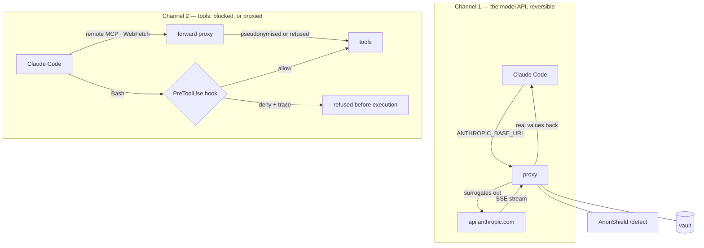

# Architecture

Two channels leave a coding agent, and only one of them can be made
reversible.



## Channel 1 — the proxy

Claude Code speaks to the proxy instead of the API. Every request body is
walked, every value the detector marks sensitive is replaced by a surrogate,
and the response is walked back the other way.

### The walker

Traversal is **inverted**: everything is traversed except an explicit list of
control keys. The opposite — enumerating the surfaces to protect — was the
first defect found, and it leaked `stop_sequences`, `mcp_servers`, `container`
and `tool_choice` on day one. New API surfaces appear regularly; a list of what
to *protect* is stale the moment it is written, a list of what to *skip* fails
loudly instead.

Two rules govern the rest:

- **Legitimacy is a property of position, not of a key name.** A block is
  protocol because it descends from a protocol container — never because it
  calls itself one. A hostile MCP server that returns `{"type": "thinking"}`
  gets no protection from having said so.
- **A signed block is opaque.** `thinking` and `redacted_thinking` carry
  signatures; traversing them invalidates the signature and the API rejects the
  turn (D3).

### Streaming

Surrogates are never resolved inside `partial_json` fragments: a value split
across two chunks would be half-restored. Fragments accumulate, and resolution
happens atomically when the block closes (D2). The SSE buffer is capped at
16 MiB, beyond which the stream is declared invalid rather than grown.

### The vault

SQLite, one row per real value, **encrypted at rest** with AES-256-GCM under a
key derived from the master secret. Lookup goes through an HMAC index, because
authenticated encryption uses a random nonce and a direct search would be
impossible; the index reveals equality and nothing else.

A wrong key yields `VaultUnavailableError` — never a guessed value. A store in
an older format is refused rather than read.

## Channel 2 — the hook

**Bash** runs on the operator's machine, against the real world, and there is
nothing to pseudonymise: a `kubectl` command has to reach the real cluster. So
the hook **blocks** rather than substitutes, before execution, and traces its
reason.

**Remote MCP and WebFetch** are a different case, and no longer belong in that
sentence: they speak HTTP, so the forward proxy sees them. Under
`task forward -- <agent>` their bodies are pseudonymised and restored like the
model API's. The hook still guards them — two controls on one channel, and
removing either opens it.

Deciding what a command actually runs is a parsing problem, not a keyword
problem. See [the command grammar](hook-parser.md).

## Forward mode — the channel a base URL cannot reach

`ANTHROPIC_BASE_URL` redirects one client's calls to one API. Remote MCP
servers, package registries and vendor tool APIs ignore it — Phase 0 measured
four such destinations against the one that honours it, and captured all four
**through an explicit proxy**.

```bash
task forward -- <any agent>      # sets HTTPS_PROXY and the trust bundle
```

| Verdict | What happens |
|---|---|
| `inspect` | TLS terminated with a local leaf, bodies pseudonymised and restored |
| `tunnel` | relayed untouched, so the client validates the origin's own certificate |
| unlisted | **refused** — no socket is opened at all |

Three properties hold it together. The upstream certificate is **verified**,
with no setting to skip it: a proxy that decrypts and then trusts anything has
moved the attack surface rather than removed it. What cannot be rewritten — a
stream with neither length nor chunking — is **refused**, because relaying it
untouched on a destination the operator declared `inspect` would say it was
read. And the authority that signs the leaves is never installed system-wide:
trust travels in the launched process's environment and dies with it.

This is also what makes the tool agent-agnostic. `HTTPS_PROXY` names no vendor,
so one launcher covers any runtime that speaks HTTP, instead of one integration
per agent.

## The detection service

AnonShield runs as a **separate process behind HTTP** (decision D7). The
boundary is not decoration: it is a licence boundary, and
[a test](https://github.com/SocialGouv/doublure/blob/main/tests/test_gpl_boundary.py)
fails on any import that crosses it.

Measured on a laptop RTX 4090: **P95 100.6 ms** on 2 KB of text (budget:
150 ms), 2.1 ms for the regex-only path used above 8000 characters.

## The control service

A Go binary exposes the arbitration API over a **Unix socket, never a port**.
The API returns real values by design; the agent runs on the same machine and
the hook lets loopback through, so a port would have handed the agent the vault
over HTTP. The price is accepted: a browser cannot speak to a Unix socket, so
the interface has to be a real client.

Go was chosen over Rust for one decisive reason: RE2 cannot backtrack. Three
adversarial rounds were spent on catastrophic regex backtracking — a free class
at the head of a pattern cost seven to fifteen seconds and could freeze the
agent without a single forbidden command. That whole family of defects becomes
impossible to write rather than something to keep finding.
