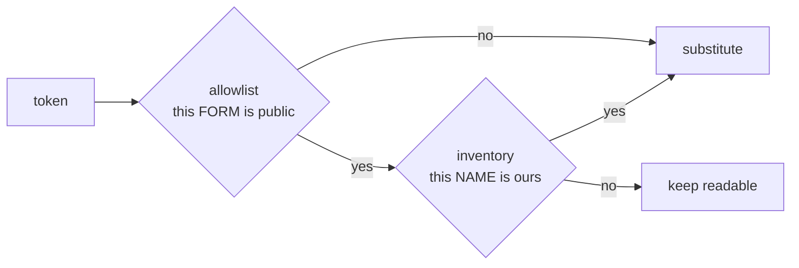

# Detection and lists

Detection answers one question: **which spans of this text identify
something?** It runs in a separate process (D7) and returns spans with types
and scores. What happens next — substitute, keep, ask — is decided on our side.

## Two detectors, composed

| Detector | Covers | Where |
|---|---|---|
| infrastructure (AnonShield) | hosts, addresses, images, secrets, 33 cyber labels | separate process, GPL side |
| personal data | **`PERSON`** — no cyber NER has that class | separate process, Apache-2.0 side |

Neither subsumes the other, and an outage of **either** is a refusal. Carrying
on without the personal-data pass would silently restore the state in which
three names left a real session with nothing to count.

The personal-data model is asked for its types **in natural language**, which
makes their wording part of the detection: `address` finds what
`postal address` does not, on the same text and the same model.

Spans are still reassembled by offset and checked for shape before anything
else sees them — a fragment would store half a name and let the other half
leave, and a ticket number classed as an address turns the document the model
reads into one about a different incident. Both were measured on a real file;
the guards stay as a net even though the current model returns whole
entities.

| Path | When | Cost |
|---|---|---|
| transformer NER + regex recognizers | normal traffic | P95 **100.6 ms** on 2 KB (GPU) |
| regex only | above `ANONPROXY_REGEX_THRESHOLD` (8000 chars) | 2.1 ms |
| personal data | every request | **~250 ms** on 1.1 KB, measured |

The regex recognizers are what actually fire on infrastructure text — on
synthetic log material the raw NER returned zero entities and every detection
came from a pattern. The model earns its place on prose, not on logs.

## Three lists, three different jobs

### `config/allowlist.txt` — what is public

Two kinds of entry, and the difference is load-bearing:

- an **exact** entry is a decision taken token by token (`localhost`,
  `monitoring`, a specific public dependency). It holds everywhere, including
  inside a composite value;
- a **`re:` rule** is a form rule. It holds only where the context justifies
  it, because a form has no context: `README.md` and `acme.md` are
  indistinguishable to it.

An entry written all lowercase means case does not matter. An entry carrying a
capital means it meant it — `Mail.Read` is a permission, not a word. The
entry's own casing declares the rule; nothing has to be classified by hand.

!!! danger "The only rule that widens the public set"

    Everything else in this system fails loudly — a 400, a 503, a refused
    command. The allowlist is the one place where a mistake fails **silently**,
    by letting a value out with no vault entry and nothing to count. A rule
    that widens it deserves its own test before it is written. Two attempts at
    declaring common words public were shipped and withdrawn; the reasons are
    in [the adversarial record](rounds.md).

### `config/inventory.txt` — what is ours

The exact inverse, and it **primes**: `org.apache.kafka.acme.PaymentsClient`
and `org.apache.kafka.clients.KafkaProducer` have the same form, and only
knowing that `acme` is yours separates them. A form rule cannot decide that; an
inventory can, without probability.

An identifier is yours as soon as one of its **segments** matches, so declaring
`acme` covers `tenant-acme-nda`, `registry.k8s.io/acme-billing` and
`vnd.acme.billing+json` at once.

This list only ever raises protection, so it cannot introduce a silent leak —
which is why it is the right place to resolve doubts. It is also the only
source that **produces** spans of its own: a name you declared is found even
where no model saw anything.

That was not always true, and the gap was measured on
`kubectl get pods -n acmecorp-billing`, where the detector returns a single
span — `TOOL: kubectl`. The namespace carried the organisation's name, the
inventory declared it, and it left in the clear: the inventory could only
SUBTRACT from what a model had already noticed. The least ambiguous instruction
an operator can give was conditional on a model happening to see the word.

!!! warning "Keep the real one out of the tree"

    This file names your organisation, your zones and your team prefixes. Point
    `ANON_INVENTORY_FILE` at a path outside the working tree. A path you ask
    for and that does not exist is an **error**, never an empty inventory:
    reading it as empty would silently re-open the names it was meant to close.

!!! note "Both sides read it, and a test proves they agree"

    The inventory used to be applied by the engine only. But the detection
    service drops a span covered by an exact allowlist entry *before* returning
    it, so that token never reached the engine and the inventory could not
    close it — the protection existed and did not act, exactly where it is
    useful: on the generic words the allowlist opens.

    `tests/test_inventory_detection.py` now judges the same values through
    both sides of the boundary and fails if they disagree.

### `config/custom_patterns.json` — your conventions

Regex recognizers for the identifier shapes your environment uses that no
general model knows: ticket references, internal naming schemes, service
account formats.

## The lists are shared, the parser is duplicated

Both the detection service (GPL side) and the surrogate engine (MIT side) read
the same files. The ten-line parser exists twice, on purpose: it is the
**list** that must be maintained once, not the code that reads it, and
sharing code across the boundary would mean sharing a licence.

## Counting what the lists let through

`/detect` returns `public_by_shape`: the deduplicated tokens a **form** rule
made public, with their span types and the rule responsible. An exact entry
never appears there — it was a decision, not a heuristic.

This exists because the alternative is a leak with no trace at all: no vault
entry, no unresolved surrogate, nothing for the egress harness or the corpus to
count. An accepted residual has to be countable, or it is not accepted, just
unnoticed.
