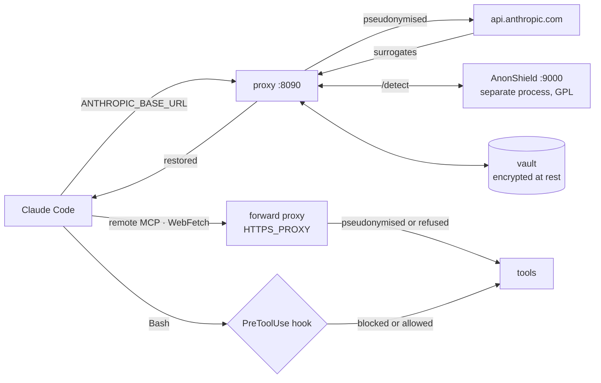

# doublure

**A coding agent is useful because it reads your real infrastructure. That is
also why it leaks it.** doublure sits between Claude Code and the Anthropic API:
sensitive identifiers become plausible stand-ins on the way out, and are
restored on the way back. The operator always sees the real thing; the model
provider sees none of it.

The name is the mechanism. A *doublure* is the stand-in who takes the hits in
the actor's place — and the lining sewn inside a coat.

-   :material-rocket-launch:{ .lg .middle } **Run it**

    ---

    Three processes, one command each. The detector needs a GPU; the rest does
    not.

    [:octicons-arrow-right-24: Start](start.md)

-   :material-scale-balance:{ .lg .middle } **Understand the stance**

    ---

    Closed by default, and only the operator opens — progressively, and never
    blocking.

    [:octicons-arrow-right-24: Philosophy](philosophy.md)

-   :material-eye-off:{ .lg .middle } **See what it does not do**

    ---

    Channel 2 is not reversible, and D9 is not met on a workstation. Both are
    stated, not buried.

    [:octicons-arrow-right-24: Known limits](limits.md)

-   :material-bug-check:{ .lg .middle } **Read what broke**

    ---

    Twenty-one adversarial rounds, each defect named — including the ones the
    fixes introduced.

    [:octicons-arrow-right-24: Adversarial record](rounds.md)

## What a surrogate looks like

Never a sentinel. `[HOST_1]` tells the model nothing, and an agent that cannot
tell two hosts apart stops being useful. A surrogate is **plausible and
type-faithful**: what replaces a hostname is a hostname, what replaces a
network is a network of the same size.

| Real | What Anthropic receives |
|---|---|
| `db-master.acme.internal` | `island-gateway.fourth-alpine.internal` |
| `srv-billing-prod-01.acme.internal` | `registry-atlas-01-prod.fourth-alpine.internal` |
| `10.1.2.0/24` | `10.135.1.0/24` — private stays private |
| `51.75.28.4` | `198.19.180.33` — RFC 2544, reserved, nobody's machine |
| `alice.dupont@acme.corp` | `winter-peyton.ollie@coho-margie.corp` |
| `https://github.com/acme-corp/billing-api` | `https://github.com/humongous-school/prairie-lagoon-api` |
| `+33 6 12 34 56 78` | `+33 6 39 98 10 41` — the range regulators reserve for fiction |
| `ghp_R3aL…` | never restored — a secret is a reference (D4) |

Those are real outputs, produced by the engine. Read the second column again:
both hosts landed in the **same** fictional zone, because they shared a real
one; the forge host survived while the org and the repository did not, because
the model still needs to know it is talking about GitHub.

The mapping lives in a local SQLite vault, encrypted at rest, outside the
repository. Restoration is exact and deterministic per project; nothing is ever
guessed (D5).

## What it is not

It is not a filter that hopes for the best. Everything detected is substituted,
and every value no rule covers is **recorded as a question** — without blocking
the session. The operator answers when they want, at the granularity they want,
and the answer applies going forward only.

It is not a wrapper around a model's goodwill either. Asking the model to
behave is the anti-pattern this project was built against: protection never
depends on the model cooperating.

!!! warning "Read the limits before you rely on it"

    **Bash output is protected**: it returns to the model through the API and
    is pseudonymised there. What is not reversible is the EXECUTION — `kubectl`
    must reach the real cluster — so on that path the hook blocks data going
    OUT rather than substituting.

    **Remote MCP and WebFetch** do, under `task forward -- <agent>`. That is
    not the default path, but it is exercised by a real Claude Code session in
    `tests/forward_e2e.sh`, which also shows the destinations Phase 0 measured
    as escaping being refused with no socket opened. On a workstation the proxy
    is still not the only network path: the egress harness *detects*, it does
    not *prevent*. See [Known limits](limits.md).
