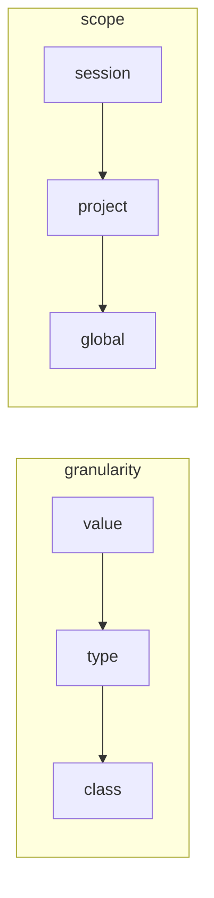

# Philosophy

> **As confidential as possible by default, with an opening that is
> configurable intelligently, progressively and interactively.**

That sentence is not a slogan: it is the criterion that settles arbitrations,
and it has four operational consequences.

## 1. Closed by default, always

Everything detected is substituted. No default opens anything — not a
threshold, not a heuristic, not a model, not an outage. When in doubt, close.

An outage closes too: if the detector is unreachable, the proxy returns 503
rather than forward text it could not examine.

## 2. Only the operator opens

Never the model, never an AI, never a shape rule left to itself. An AI may
**propose** — route a doubt, suggest an inventory entry — it does not decide.

This is not caution for its own sake. It follows from an asymmetry:

| | "Anonymise" | "Reveal" |
|---|---|---|
| cost | free, reversible | lets a value out, permanently |
| error is | **visible** — the agent stumbles, you see it | **silent** — nothing looks wrong |
| revoking it | restores the previous state | does not recall what has gone |

So revealing is written down, traced, and never inherited from a default.

## 3. Opening is progressive

Two axes, from narrowest to widest:

The narrowest and the nearest win. This is what makes the system usable: one
decision at class level turns thirty questions into one. In a measured session,
grouping the queue by type took **462 pending values down to 14 gestures**.

## 4. Opening is interactive, and never blocking

The system anonymises, records the question, and carries on. The operator
answers when they want; the answer persists and applies **going forward only**.

They may also reveal nothing and instead tell the model how to proceed without
the value — that is a legitimate answer, and often the right one.

## Modes are this philosophy applied

A mode is a named **set of settings**, never opaque behaviour: it prints, it can
be overridden one setting at a time, and it resolves through the same scope
hierarchy as the rules.

| Mode | What it changes |
|---|---|
| `auto` | substitutes everything without asking; the agent solicits if it gets stuck |
| `consciencieux` | the request **waits** for arbitration, with a deadline that anonymises — a lapsed timer never counts as consent |
| `ferme` | the model is told nothing |

**No mode can open anything.** They choose *when the operator is asked*, not
*whether protection applies*.

## Two corollaries that decide code

**An arbitration that pits two principles against each other becomes a
setting, not a constant.** The textbook case is `domaines_fictifs`: real TLDs
make a fictional domain plausible (D1) at the risk that it really exists;
RFC 2606 reserved names guarantee the opposite at the cost of plausibility.
Neither is "the right one" — which is exactly why it is configurable.

**An accepted residual must be counted, never silent.** `/detect` returns
`public_by_shape`: the deduplicated list of tokens a *form* rule made public,
with their span types and the rule at fault. What fails must fail loudly — the
only failure mode this project treats as unacceptable is the one nobody can
see.
